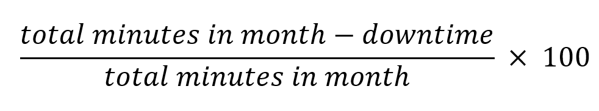

# Topl Services Availability Policy

Topl will use commercially reasonable efforts to maximize the availability of the Services Console as well as the Services defined in the BaaS License Agreement. We will endeavor to provide performance standards as defined below.

If over the course of a month, we fail to maintain the Availability Percentages outlined in the table below, then you may be eligible for a Subscription Credit based on your Subscription Tier.

| Availability Percentage | Subscription Credit |
|:-----------------:|:-------------------:|
|      < 99.8%      |         10%         |
|       < 99%       |         25%         |
|       < 95%       |         50%         |

## Definitions

Throughout this Services Availability Policy, the term "month" refers to a calendar month.

"Downtime" is calculated on a monthly basis and equal to the total number of minutes during the month that any of the Services were unavailable. The Services are considered unavailable if all of your continuous attempts to access the Services Console within the minute fail or three of more API endpoints have error rates greater than 25%. Downtime does not include partial minutes of unavailability or scheduled downtime for maintenance and upgrades.

"Availability Percentage" will be calculated on a monthly basis as follows:

A "Subscription Credit" is the percentage of your monthly Subscription Fee to be credited to you if Topl approves your claim.

## Your Obligations

In order to be eligible for a Subscription Credit you must:

1. Contact Topl through designated support channels within 24 hours of first becoming aware of an event that impacts service availability;
1. Submit your claim and all required information by the end of the month immediately following the month in which the Downtime occurred;
1. Provide all information necessary for us to validate your claim, including: (i) a detailed description of the events resulting in Downtime, including your request logs that document the errors; (ii) information regarding the time and duration of the Downtime; (iii) descriptions of your attempts to resolve the Downtime at the time of occurrence.
1. Reasonably assist us in investigating the cause of the Downtime and processing your claim.
You must comply with your applicable Topl agreements, relevant Topl documentation and any advice from our support team.

## Limitations

Downtime does not include, and you will not be eligible for any Subscription Credit for, performance issues or lack of availability resulting from:

1. Factors outside of our reasonable control, such as pandemic or public health emergency, natural disaster, war, acts of terrorism, riots, government action, or a network or device failure at your site or between your site and those of Topl;
1. Services, hardware, or software provided by a third party, such as cloud services, platforms, or infrastructure on which Topl's Services run;
1. Your or any third party’s improper use or failure to follow appropriate security practices;
1. Planned maintenance and upgrades periodically performed by Topl.

## Subscription Credits
We will process valid claims within 45 days of receipt. If we determine that you have satisfied the obligations listed in this policy and that none of the above limitations apply to your claim, we will grant you a Subscription Credit.

We will apply any Subscription Credit beginning on your next invoice or payment for Topl Services.